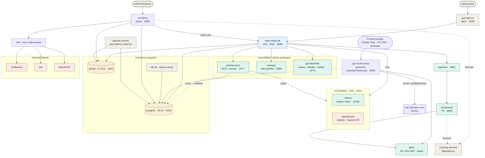

> 🌐 **Kalba / Language:** **Lietuvių** · [English](ARCHITECTURE.md)

# GuardPrompt — architektūra

On-premise AI dokumentų platforma. Trys plotmės:

- **Runtime** (kairė): vartotojas per `guardproxy` pasiekia `OpenWebUI`; ta naudoja vidines
  paslaugas, LLM tiekėją ir duomenų saugyklas.
- **KB valdymas** (dešinė): administratorius per `kb-admin` prijungia išorinį turinį
  (Confluence / Jira / SharePoint) į OpenWebUI žinių bazes; `oikb` sinchronizuoja.
- **Programuotojų įrankiai** (`gp-claude-proxy`): įmonės Claude Code klientai —
  Claude Code CLI, VS Code plėtinys ir JetBrains IDE (o darbalaukio aplikacija tik
  API-rakto režime) — nukreipiami per GuardPrompt, kad niekas nepasiektų Anthropic
  neapdorota. Veikia vienu iš dviejų kredencialų režimų
  (vienas globalus jungiklis): **prenumeratos pass-through** (relay'inamas kiekvieno
  programuotojo claude.ai login) arba **bendras API raktas** (vienas centrinis Anthropic
  raktas + per-programuotojo gate žymės). Gali saugoti ir **pseudonimizuotą kas-ką-siuntė
  auditą** (`gp_audit`, GDPR 30 str.).
- **Stebėsena** (`monitoring`): Zabbix stekas skaito vienodas Prometheus `/metrics` iš
  `gp-claude-proxy`, `gliner` ir `anonymizer`, plius standartinius eksporterius, ir varo
  preventyvius + atminties-nutekėjimo trigerius bei dashboard'us ([MONITORING.lt.md](MONITORING.lt.md)).

Abi plotmės stato GuardPrompt **ant kelio į modelį**, tad nė vienas komponentas negali
savarankiškai išsiųsti žalio turinio LLM tiekėjui:

| Plotmė | Kelias | Kryptis |
|---|---|---|
| Pokalbiai / dokumentai | `pipelines` → `anonymizer` → LLM | vienkryptis uždengimas (`[PERSON]`) — vartotojas skaito rezultatą, nieko atstatyti nereikia |
| Programuotojų įrankiai | Claude aplikacija → `gp-claude-proxy` → Anthropic | **grįžtamas** pseudonimizavimas (`GP_a3298922c55a`) — atsakymas įrašomas į failus, tad žemėlapis privalo atstatyti |

Anonimizatorius **integruotas per `pipelines`** (Pipeline „GuardPrompt Anonymizer" kviečia
`http://anonymizer:8005/api/anonimize`) — ne tiesioginis OpenWebUI loaderis.

**Injekcijų tikrinimas veikia toje pačioje plokštumoje.** Nepatikimas tekstas ateina
vartotojų įkeliamuose dokumentuose, todėl patikros gyvena ten, kur tas tekstas apdorojamas,
o ne atskirame šliuze: `docling` neperduoda to, ko skaitytojas nematytų (baltas ant balto,
~1 pt, už puslapio ribų), o `anonymizer` rašto anomalijos ir semantinį tikrinimus vykdo
**po** viso maskavimo — tikrindamas būtent tą tekstą, kuris pasieks modelį. Semantinis
kviečia `/injection` endpoint'ą `gliner` konteineryje, kuris dabar GPU laiko du modelius
(NER + daugiakalbį enkoderį). Rasta vieta tampa `[PROTECTION]`; dokumentai neatmetami.
Kodėl kiekvienas sluoksnis reikalingas, ką išmatuotai pagauna ir kur nepakanka:
[COMPLIANCE.lt.md](COMPLIANCE.lt.md).

Kadangi tas filtras yra globali `pipelines: ["*"]` taisyklė (visiems modeliams), maskavimo
plokštuma pasiekiama **ir programiškai, ne tik iš UI**: programuotojas ar įrankis, kviečiantis
OpenWebUI OpenAI-suderinamą chat API (`POST /api/chat/completions`) su OpenRouter modeliu, gauna
tą pačią vienkryptę anonimizaciją prieš užklausai išeinant į OpenRouter — atskiro šliuzo leisti
nereikia. Tai skiriasi nuo `gp-claude-proxy`, kuris yra atskiras Anthropic-formato šliuzas su
*grįžtama* pseudonimizacija ([API.lt.md](API.lt.md#chat-api-per-openwebui-openai-suderinamas)).

## Konteineriai ir portai

| Konteineris | Image / build | Portas (host) | Paskirtis |
|---|---|---|---|
| `guardproxy` | build | `9099`, `8010` | nginx įėjimo vartai |
| `open-webui-dk` | `open-webui:v0.10.2-cuda` | `127.0.0.1:8080` | pokalbiai, RAG, GPU |
| `pipelines` | `open-webui/pipelines:main` | `127.0.0.1:9091` | funkcijos (t. p. anonimizatorius) |
| `anonymizer` | build | `8005` | PII slėpimas (per pipeline) |
| `gp-claude-proxy` | build | `127.0.0.1:8006` | Claude šliuzas — grįžtamas pseudonimizavimas Claude Code / VS Code / JetBrains (darbalaukis tik API-rakto režime); du kredencialų režimai (prenumeratos pass-through / bendras API raktas) + nebūtinas kas-siuntė auditas ([GP-CLAUDE-PROXY.lt.md](GP-CLAUDE-PROXY.lt.md)) |
| `gliner` | build | `127.0.0.1:8500` (metrikos) | BDAR 9/10 str. NER + injekcijų enkoderis — **GPU spartinamas su dinaminiu batching (~70 užkl./s)**; kviečia `anonymizer` **ir** `gp-claude-proxy` |
| `docling-serve` | build | `8777` | OCR + dokumentų konvertavimas |
| `searxng` | `searxng:2026.6.30-d115c61a7` | `127.0.0.1:8089`, `5678` | web paieška |
| `gp-transcribe` | build | `127.0.0.1:8770` | balsas → tekstas (vietinis svogunas / faster-whisper) |
| `ollama` | `ollama:0.31.1` | vidinis `11434` | lokalus vision LLM (profilis `ollama`) |
| `postgres` | `postgres:16.14` | `5432` | OpenWebUI + `kbadmin` schema |
| `qdrant` | `qdrant:v1.18.2` | `6333`, `19999` | vektorinė bazė |
| `db-trigger-init` | `postgres:16.14` | — | vienkartinis trigerių setup |
| `kb-admin` | build | `127.0.0.1:8090` | KB valdymo pultas |
| `uploads-cleaner` | build | — | periodinis įkėlimų valymas |

Išoriniai: **OpenRouter** (arba bet koks OpenAI-compat API) chat LLM'ui per OpenWebUI;
**Confluence / Jira / SharePoint** turinio šaltiniai; **Licencijų serveris** (dkprojektai.lt).

## Priklausomybės (esmė)

- `open-webui-dk` → `postgres`, `qdrant` (deps); vykdymo metu → `docling-serve`,
  `searxng`, `gp-transcribe`, `pipelines`, LLM (`ollama` / OpenRouter).
- `pipelines` → `anonymizer` (PII slėpimas per Pipeline).
- `anonymizer` → `gliner` (BDAR 9/10 str. kategorijos; **nepasiekiamas → užklausa BLOKUOJAMA**, ne praleidžiama — `ANON_REQUIRE_GLINER`, pagal nutylėjimą įjungta).
- `docling-serve` → LLM **vision** (`ollama` / OpenRouter); rašo sesijas į `postgres`.
- `kb-admin` (deps: `postgres`, `open-webui-dk`) → OpenWebUI REST API; paleidžia `oikb`
  kaip subprocesą; rašo į `postgres` (`kbadmin`) + valo `qdrant` vektorius.
- `oikb` → `Confluence` / `Jira` / `SharePoint`.
- `uploads-cleaner` → `postgres` + `qdrant`.
- `db-trigger-init` → `postgres` (vienkartinis).
- Licenciją tikrina `kb-admin` **ir** `anonymizer`.

> LLM: `ollama` (lokalus, VRAM, `OLLAMA_KEEP_ALIVE=-1`) ir `OpenRouter` (debesis) —
> abu OpenAI-compat, keičiami per `.env` / OpenWebUI. Image versijos **pinuotos**
> `docker-compose.yml` (jokio auto-update).

## Greitaveikos pastabos

- **`gliner` veikia ant GPU.** NER modelis ir injekcijų enkoderis startuojant perkeliami
  į CUDA (`model_on_gpu` metrika = 1) ir aptarnaujami per **asyncio dinaminį batcher'į**,
  sujungiantį lygiagrečias užklausas į vieną `batch_predict_entities` kvietimą. Tai pakėlė
  pralaidumą nuo ~4 užkl./s (ankstyva CPU-fallback regresija) iki ~70 užkl./s (~17×) — atsarga,
  leidžianti visai komandai vienu metu kreiptis į anonimizatorių ir Claude šliuzą. Per-procesо
  **block cache** (turinio-hash raktu) reiškia, kad iš naujo atsiųstas pokalbis maskuojamas
  kartą, ne kiekvieną turną.
- **`gp-claude-proxy` — vienas async worker.** Deterministinės HMAC žymės laiko prompt cache
  stabilų per turnus; saugyklos rašymas praleidžiamas cache hit'e. Event loop yra mastelio
  riba — būtent todėl stebėsenos plokštuma seka event-loop delsą ir DB-pool kaip nutekėjimo
  indikatorius.

## Stebėsenos ir audito plokštuma

Kiekvienas vidinis servisas atskleidžia Prometheus-text metrikas `GET /metrics`
(`gp-claude-proxy`, `gliner:8500`, `anonymizer`), apimant užklausos/maskavimo latenciją,
užmaskuotų span'ų skaičius, fail-closed įvykius, upstream statusą ir nutekėjimų-aptikimo
gauge'us (proceso RSS/FD, event-loop delsa, asyncio task'ai, DB-pool naudojama/laisva, cache
dydis/iškraustymai, `model_on_gpu`). **Zabbix** stekas (dedikuotas Postgres + server + web)
skaito juos vienodai per HTTP-agent master item'us su dependent `PROMETHEUS_PATTERN` ištraukimu,
papildytu standartiniais eksporteriais (node, cAdvisor, postgres, blackbox, DCGM GPU host'uose)
ir per-vartotojo naudojimo LLD iš `gp_audit`. Trigeriai pakopiniai ir **preventyvūs**
(`forecast()`/`timeleft()`/`nodata()` diskui, sertifikatui ir pool išsekimui) bei
**nutekėjimo-jautrūs** (kylantis `trendmin()` dugnas, event-loop delsa, ryšių išsipūtimas,
`*_fail_closed_total`). Pilna specifikacija, template ir dashboard'ai: [MONITORING.lt.md](MONITORING.lt.md).

**Audito** saugvietė (`gp_audit`, pasirenkama) — antra Postgres lentelė, laikanti po vieną
pseudonimizuotą eilutę Claude užklausai — tik naujas turnas, GP_ žymės niekada žalias — plius
išspręstą siuntėjo tapatybę (`X-GP-User` → `metadata.user_id` → kredencialo-hash owner), IP ir
baitų skaičių, prunint'a ties `GP_AUDIT_TTL_DAYS`. Tai GDPR 30 str. DI naudojimo įrašas,
laikomas atskirai nuo grįžtamo `gp_vault`.

## Anonimizavimo aprėptis

`anonymizer` slepia PII **ir KB ingestijos, IR live chat metu** (`gp-pipeline.py`
inlet filtras anonimizuoja kiekvieną vartotojo žinutę + prisegtų nuotraukų OCR
PRIEŠ siunčiant į LLM, t. p. į išorinį OpenRouter). Filtras **fail-closed**: jei
anonimizavimas nepavyksta/timeout → žinutė blokuojama, RAW tekstas niekada
neiškeliauja (valdoma `fail_closed` valve).

Sluoksniai valdomi `.env` (`ANON_*`) ir taisomi allowlist'u: `ANON_ALLOW_WORDS`
(tikslūs žodžiai/frazės) ir `ANON_ALLOW_REGEX` (pattern'ai — linksniai, raidžių dydis,
patikimų institucijų pavadinimai). Allowlist'inti fragmentai tokenizuojami **prieš** bet
kokį maskavimo sluoksnį ir atstatomi po jo, tad išlieka ir po regex, ir po NER paso.
Per-uždengimą pataisai vienu įrašu, be kodo. **Nutekėjimas laikomas blogesniu nei
per-uždengimas.**

1. **Identifikatoriai (regex, determinist.)** — asmens kodas, el. paštas, telefonas,
   IBAN, kortelė, kripto, IP (v4/v6), data, laikas, pinigai, įmonė, įm. kodas, PVM,
   dok. nr. Vardai/pavardės — LT žodynas. **Dokumentų numeriai** (`doc_id_regexes.py`):
   pasas, ATK, SODRA, SWIFT/BIC, bylos/sutarties nr., paciento/ligos istorijos nr.,
   licencijos raktai.
2. **Transportas & IT (regex, `vehicle_it_regexes.py`)** — valst. numeriai
   (LT formatas + konteksto inkaras), vairuotojo pažymėjimas, registracijos
   liudijimas / techninis pasas, MAC, VIN, IMEI, **GPS koordinatės**. Eina PRIEŠ
   bendrą dok. numerį (kolizijos fix).
3. **Dev/IT paslaptys (regex, `secrets_regexes.py`)** — cloud/SaaS tokenai
   (AWS/GitHub/OpenAI/Slack/Google/Stripe/JWT), PEM privatūs raktai / sertifikatai,
   SSH raktai (daugiaeiliai — prieš segmentaciją), connection stringai su
   kredencialais, `Bearer`, config `key=value` paslaptys.
4. **GDPR Art. 9/10 + AI Act Art. 5(1)(g) (`gliner` NER, `gp_special.py`)** — sveikata,
   psichika, kriminalas, politika, religija, profsąjunga, biometrija, pranešėjas,
   **rasinė/etninė kilmė, seksualinė orientacija, filosofiniai įsitikinimai** (+ siauri
   LT žodynai ten, kur gliner silpnas), užsienio/linksniuoti vardai, užsienio/vanity
   valst. numeriai. Veikia ant žalio teksto prieš regex sluoksnį. **Jei `gliner`
   nepasiekiamas, užklausa BLOKUOJAMA**
   (`[PROCESSING DISABLED: ANONYMIZATION SERVICE UNAVAILABLE]`), o ne apdorojama be
   9/10 str. dangos — fail-closed pagal nutylėjimą (`ANON_REQUIRE_GLINER=true`).
   `false` nustatykite tik jei pasiekiamumas svarbiau už pilnumą.
   Šalindamas šiuos atributus, sprendimas neleidžia LLM jų išvesti —
   atitiktis AI Act draudimui dėl jautrių atributų kategorizavimo **by-design**.

**NER išvesties validavimas (tikslumas).** Zero-shot NER modelis per plačiai žymi LT
teisiniame/administraciniame tekste — pareigybės, institucijos ir teisiniai terminai grįžta
kaip `person` („…departamento direktoriui", „Lietuvos Respublikos"). Kiekvienas `gliner`
**person** span'as validuojamas bendru filtru (`person_noise.py`): span'as, kuriame yra
pareigybės/institucijos/teisinio termino daiktavardžio šaknis, atmetamas — tikras vardas jos
niekada neturi. Tai generalizuoja bet kuriam titului be taisyklės kiekvienai frazei ir yra
**vienas šaltinis, bendras anonimizatoriui ir `gp-claude-proxy` šliuzui** (importuojamas per
`/rules` mount), tad abu lieka sinchronizuoti. Spec-kategorijų žymės sąmoningai paliktos
agresyvios — dokumente, kuris *apibrėžia* GDPR kategorijas, kategorijų žodžiai uždengiami;
tai bendro teisinio teksto per-uždengimas, ne nutekėjimas.

> **GDPR + DI akto atitiktis** (straipsnis po straipsnio): [COMPLIANCE.lt.md](COMPLIANCE.lt.md).
> **Anonimizavimo API** — du programiniai įėjimai ([API.lt.md](API.lt.md)): (1) tas pats
> `anonymizer` kaip REST API, tad jūsų pačių programos gali maskuoti tekstą ir dokumentus
> tiesiogiai (Bearer raktas, JSON/plain/failas, `/process` PDF/DOCX/…); (2) OpenWebUI
> OpenAI-suderinamas chat API, tad įrankiai gali kviesti OpenRouter LLM su automatiškai
> pritaikoma anonimizacija ([chat API](API.lt.md#chat-api-per-openwebui-openai-suderinamas)).
