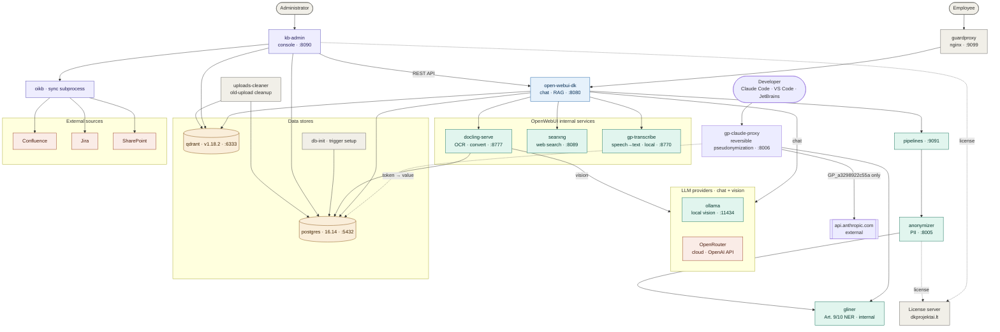

> 🌐 **Language / Kalba:** **English** · [Lietuvių](ARCHITECTURE.lt.md)

# GuardPrompt — architecture

On-premise AI document platform. Three planes:

- **Runtime** (left): a user reaches `OpenWebUI` through `guardproxy`; it uses the internal
  services, an LLM provider and the data stores.
- **KB management** (right): an administrator connects external content
  (Confluence / Jira / SharePoint) into OpenWebUI knowledge bases via `kb-admin`; `oikb` syncs.
- **Developer tooling** (`gp-claude-proxy`): the company's Claude Code clients —
  Claude Code CLI, the VS Code extension and JetBrains IDEs (and the desktop app in
  API-key mode only) — are routed through GuardPrompt before anything reaches
  Anthropic. It runs in one of two credential modes (a single
  global switch): **subscription pass-through** (each developer's own claude.ai login is
  relayed) or **shared API key** (one central Anthropic key + per-developer gate tokens).
  It can also persist a **pseudonymized who-sent-what audit** (`gp_audit`, GDPR Art. 30).
- **Observability** (`monitoring`): a Zabbix stack scrapes uniform Prometheus `/metrics`
  from `gp-claude-proxy`, `gliner` and `anonymizer`, plus standard exporters, and drives
  preventive + memory-leak triggers and dashboards ([MONITORING.md](MONITORING.md)).

Both planes put GuardPrompt **on the path to the model**, so no component can send raw
content to an LLM provider on its own:

| Plane | Path | Direction |
|---|---|---|
| Chat / documents | `pipelines` → `anonymizer` → LLM | one-way masking (`[PERSON]`) — the user reads the result, nothing is restored |
| Developer tooling | Claude client → `gp-claude-proxy` → Anthropic | **reversible** pseudonymization (`GP_a3298922c55a`) — the answer is written back into source files, so the mapping must reverse |

The anonymizer is **integrated via `pipelines`** (the "GuardPrompt Anonymizer" pipeline calls
`http://anonymizer:8005/api/anonimize`) — not a direct OpenWebUI loader.

**Injection screening rides on the same plane.** Untrusted text arrives inside the
documents users upload, so the checks live where that text is handled, not in a separate
gateway: `docling` refuses to pass on anything a reader could not have seen (white-on-white,
~1 pt, off-page), and the `anonymizer` runs the script-anomaly and semantic scans **after**
all masking is finished — screening exactly the text that will reach the model. The semantic
scan calls a `/injection` endpoint on the `gliner` container, which now serves two models on
the GPU (NER + a multilingual encoder). Anything identified becomes `[PROTECTION]`; documents
are never rejected. Why each layer exists, what it measurably catches and where it fails:
[COMPLIANCE.md](COMPLIANCE.md).

Because that filter is a global `pipelines: ["*"]` rule (every model), the masking plane is
reachable **programmatically as well as from the UI**: a developer or tool calling OpenWebUI's
OpenAI-compatible chat API (`POST /api/chat/completions`) with an OpenRouter model gets the
same one-way anonymization before the request leaves for OpenRouter — no separate gateway to
run. This is distinct from `gp-claude-proxy`, which is a standalone Anthropic-format gateway
with *reversible* pseudonymization ([API.md](API.md#chat-api-through-openwebui-openai-compatible)).

## Containers and ports

| Container | Image / build | Port (host) | Purpose |
|---|---|---|---|
| `guardproxy` | build | `9099`, `8010` | nginx entry gateway |
| `open-webui-dk` | `open-webui:v0.10.2-cuda` | `127.0.0.1:8080` | chat, RAG, GPU |
| `pipelines` | `open-webui/pipelines:main` | `127.0.0.1:9091` | functions (incl. the anonymizer) |
| `anonymizer` | build | `8005` | PII masking (via pipeline) |
| `gp-claude-proxy` | build | `127.0.0.1:8006` | Claude gateway — reversible pseudonymization for Claude Code / VS Code / JetBrains (desktop in API-key mode); two credential modes (subscription pass-through / shared API key) + optional who-sent audit ([GP-CLAUDE-PROXY.md](GP-CLAUDE-PROXY.md)) |
| `gliner` | build | `127.0.0.1:8500` (metrics) | GDPR Art. 9/10 NER + injection encoder — **GPU-accelerated with dynamic batching (~70 req/s)**; called by `anonymizer` **and** `gp-claude-proxy` |
| `docling-serve` | build | `8777` | OCR + document conversion |
| `searxng` | `searxng:2026.6.30-d115c61a7` | `127.0.0.1:8089`, `5678` | web search |
| `gp-transcribe` | build | `127.0.0.1:8770` | speech → text (local svogunas / faster-whisper) |
| `ollama` | `ollama:0.31.1` | internal `11434` | local vision LLM (profile `ollama`) |
| `postgres` | `postgres:16.14` | `5432` | OpenWebUI + `kbadmin` schema |
| `qdrant` | `qdrant:v1.18.2` | `6333`, `19999` | vector database |
| `db-trigger-init` | `postgres:16.14` | — | one-off trigger setup |
| `kb-admin` | build | `127.0.0.1:8090` | KB management console |
| `uploads-cleaner` | build | — | periodic upload cleanup |

External: **OpenRouter** (or any OpenAI-compatible API) for the chat LLM via OpenWebUI;
**Confluence / Jira / SharePoint** content sources; **License server** (dkprojektai.lt).

## Dependencies (essentials)

- `open-webui-dk` → `postgres`, `qdrant` (deps); at runtime → `docling-serve`,
  `searxng`, `gp-transcribe`, `pipelines`, LLM (`ollama` / OpenRouter).
- `pipelines` → `anonymizer` (PII masking via the pipeline).
- `anonymizer` → `gliner` (GDPR Art. 9/10 categories; **if unreachable → the request is BLOCKED**, not skipped — `ANON_REQUIRE_GLINER`, default on).
- `docling-serve` → LLM **vision** (`ollama` / OpenRouter); writes sessions to `postgres`.
- `kb-admin` (deps: `postgres`, `open-webui-dk`) → OpenWebUI REST API; runs `oikb`
  as a subprocess; writes to `postgres` (`kbadmin`) + clears `qdrant` vectors.
- `oikb` → `Confluence` / `Jira` / `SharePoint`.
- `uploads-cleaner` → `postgres` + `qdrant`.
- `db-trigger-init` → `postgres` (one-off).
- The license is checked by both `kb-admin` **and** `anonymizer`.

> LLM: `ollama` (local, VRAM, `OLLAMA_KEEP_ALIVE=-1`) and `OpenRouter` (cloud) —
> both OpenAI-compatible, switchable via `.env` / OpenWebUI. Image versions are **pinned**
> in `docker-compose.yml` (no auto-update).

## Performance notes

- **`gliner` runs on the GPU.** The NER model and the injection encoder are moved to
  CUDA at startup (`model_on_gpu` metric = 1) and served through an **asyncio dynamic
  batcher** that coalesces concurrent requests into one `batch_predict_entities` call.
  This took throughput from ~4 req/s (an early CPU-fallback regression) to ~70 req/s
  (~17×) — the headroom that lets a whole team hit the anonymizer and the Claude proxy at
  once. A per-process **block cache** (content-hash keyed) means a re-sent conversation is
  masked once, not every turn.
- **`gp-claude-proxy` is a single async worker.** Deterministic HMAC tokens keep the
  prompt cache stable across turns; the vault write is skipped on a cache hit. The event
  loop is the scaling limit, which is exactly why the monitoring plane watches event-loop
  lag and the DB-pool as leak indicators.

## Observability & audit plane

Every in-house service exposes Prometheus-text metrics on `GET /metrics`
(`gp-claude-proxy`, `gliner:8500`, `anonymizer`), covering request/mask latency,
masked-span counts, fail-closed events, upstream status, and leak-detection gauges
(process RSS/FDs, event-loop lag, asyncio tasks, DB-pool in-use/idle, cache
size/evictions, `model_on_gpu`). A **Zabbix** stack (dedicated Postgres + server + web)
scrapes these uniformly via HTTP-agent master items with dependent `PROMETHEUS_PATTERN`
extraction, complemented by standard exporters (node, cAdvisor, postgres, blackbox,
DCGM on GPU hosts) and per-user usage LLD from `gp_audit`. Triggers are tiered and
**preventive** (`forecast()`/`timeleft()`/`nodata()` for disk, cert and pool exhaustion)
and **leak-aware** (rising-floor `trendmin()`, event-loop lag, connection bloat,
`*_fail_closed_total`). Full spec, template and dashboards: [MONITORING.md](MONITORING.md).

The **audit** store (`gp_audit`, opt-in) is a second Postgres table holding one
pseudonymized row per Claude request — the new turn only, GP_ tokens never raw — plus the
resolved sender identity (`X-GP-User` → `metadata.user_id` → credential-hash owner), IP and
byte count, pruned at `GP_AUDIT_TTL_DAYS`. It is the GDPR Art. 30 record of AI usage,
kept separate from the reversible `gp_vault`.

## Anonymization coverage

The `anonymizer` masks PII **both at KB ingestion AND during live chat** (the `gp-pipeline.py`
inlet filter anonymizes every user message + attached-image OCR BEFORE sending it to the LLM,
including external OpenRouter). The filter is **fail-closed**: if anonymization fails/times out
→ the message is blocked, raw text never leaves (controlled by the `fail_closed` valve).

Layers are controlled via `.env` (`ANON_*`) and corrected with an allowlist: `ANON_ALLOW_WORDS`
(exact terms/phrases) and `ANON_ALLOW_REGEX` (patterns — inflected forms, casing, trusted
institution names). Allowlisted spans are tokenised **before** any masking layer and restored
after, so they survive both the regex and the NER pass. You fix over-masking with one entry, no
code change. **A leak is treated as worse than over-masking.**

1. **Identifiers (deterministic regex)** — personal code, email, phone, IBAN, card, crypto,
   IP (v4/v6), date, time, money, company, company code, VAT, document nr. Names/surnames —
   LT dictionary. **Document numbers** (`doc_id_regexes.py`): passport, ID card, SODRA,
   SWIFT/BIC, court case/contract nr., patient/medical record nr., license keys.
2. **Vehicle & IT (regex, `vehicle_it_regexes.py`)** — license plates
   (LT format + context anchor), driver's license, vehicle registration / tech passport,
   MAC, VIN, IMEI, **GPS coordinates**. Runs BEFORE the generic document number (collision fix).
3. **Dev/IT secrets (regex, `secrets_regexes.py`)** — cloud/SaaS tokens
   (AWS/GitHub/OpenAI/Slack/Google/Stripe/JWT), PEM private keys / certificates,
   SSH keys (multiline — before segmentation), connection strings with credentials,
   `Bearer`, config `key=value` secrets.
4. **GDPR Art. 9/10 + AI Act Art. 5(1)(g) (`gliner` NER, `gp_special.py`)** — health,
   mental health, criminal record, political, religious, trade union, biometric, whistleblower,
   **racial/ethnic origin, sexual orientation, philosophical belief** (+ narrow LT dictionaries
   where gliner is weak), foreign/inflected names, foreign/vanity plates. Runs on raw text
   before the regex layer. **If `gliner` is unreachable the request is BLOCKED**
   (`[PROCESSING DISABLED: ANONYMIZATION SERVICE UNAVAILABLE]`) rather than processed without
   Art. 9/10 coverage — fail-closed by default (`ANON_REQUIRE_GLINER=true`). Set it to `false`
   only if availability matters more than completeness. By removing these attributes,
   the solution prevents the LLM from inferring them — AI Act compliance with the ban on
   categorizing sensitive attributes **by design**.

**NER-output validation (precision).** A zero-shot NER model over-labels on Lithuanian
legal/administrative text — job titles, institutions and legal terms come back as `person`
("…departamento direktoriui", "Lietuvos Respublikos"). Every `gliner` **person** span is
validated against a shared filter (`person_noise.py`): a span containing an office/role/legal-term
noun stem is rejected, because a real name never does. This generalises to any title without a
rule per phrase, and is the **single source of truth shared by both the anonymizer and the
`gp-claude-proxy` gateway** (imported via the `/rules` mount) so the two stay in lockstep.
The special-category labels are left deliberately aggressive — on a document that *defines* the
GDPR categories the category words get masked; that is over-masking of generic legal text, not a
leak.

> **GDPR + AI Act compliance** (article by article): [COMPLIANCE.md](COMPLIANCE.md).
> **Anonymization API** — two programmatic entry points ([API.md](API.md)): (1) the same
> `anonymizer` exposed as a REST API, so your own applications can mask text and documents
> directly (Bearer key, JSON/plain/file, `/process` for PDFs/DOCX/…); (2) OpenWebUI's
> OpenAI-compatible chat API, so tools can call an OpenRouter LLM with the anonymization
> applied automatically ([chat API](API.md#chat-api-through-openwebui-openai-compatible)).
