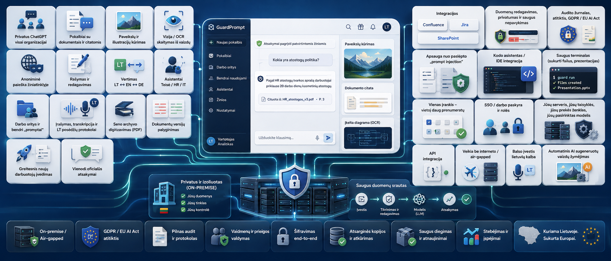

<p align="center">
  <a href="https://www.guardprompt.lt/" target="_blank">
    
  </a>
</p>
<br>
<p align="center">
  
</p>
<br>
<p align="center">🌐 <a href="README.md">English</a> · <b>Lietuvių</b></p>

# GuardPrompt

## Visas dirbtinis intelektas, kokį jau naudoja jūsų įmonė — tik viduje ir po jūsų kontrole.

GuardPrompt duoda jūsų žmonėms tą patį pilną ChatGPT lygio DI, kurį jie jau slapta atsidaro telefone — pokalbius su galingiausiais modeliais, dokumentų analizę, vaizdų kūrimą, interneto paiešką, balsą — bet veikiantį **jūsų serveryje, jūsų sienose.** Kiekvienas žodis nuasmeninamas prieš išeidamas, tad darbas nesustoja, o duomenys niekur nenutekа. Klausimas ne *ar* jūsų įmonė naudos DI — jį jau naudoja. Klausimas — *ar jį matysite ir valdysite.*

> **Nemaloni tiesa.** Kol vadovybė svarsto, ar „saugu", buhalterė jau klijuoja atlyginimų lentelę į ChatGPT, teisininkas — sutartį, programuotojas — jūsų kodą. Uždrausti neveikia; žmonės naudos vis tiek, tik slapčiau. Vienintelis realus sprendimas — duoti tą galią viduje.

> 🚀 **Nori tiesiog įdiegti?** → [Greita pradžia](#greita-pradžia)

### Kas keičiasi nuo pirmos dienos

| Šiandien | Su GuardPrompt |
|----------|----------------|
| Darbuotojai slapta neša duomenis į ChatGPT | Tas pats DI — bet jūsų viduje, po kontrole |
| „Negalim naudot DI su tikrais duomenimis" | Dirbate su tikromis sutartimis ir bylomis |
| Protokolus rašot ranka po posėdžio | Įrašot — gaunat paruoštą protokolą lietuviškai |
| Atsakymo ieškot po dešimtis dokumentų | Klausiat paprasta kalba — atsakymas su šaltiniu |
| Programuotojai kiša kodą į Copilot | Naudoja galingiausią DI, kodas lieka nematomas |
| VDAI paklaus — nėra ką parodyt | Žurnalas: kas, ką, kada siuntė |
| Prenumeratos × šimtai žmonių | Vienas variklis visai organizacijai |

### Ką iš tikrųjų gaunate

**🤖 Pilną privatų ChatGPT visai komandai.**
Vienas pažįstamas langas: kalbatės su bet kuriuo modeliu — ir pasauliniais, ir vietiniais — viskas, ką moka ChatGPT, tik jūsų namuose.

**📂 Pokalbį su savo dokumentais, ne tik su modeliu.**
Įkeliate sutartį, ataskaitą ar visą žinių bazę ir klausiate paprasta kalba — atsakymas ateina su nuoroda į šaltinį. Nebereikia žinoti, kuriame iš tūkstančio failų slypi atsakymas.

**🎨 Vaizdų ir iliustracijų kūrimą.**
Plakatas, schema, iliustracija pristatymui ar juodraščiui — sukuriama vietoje, be jokio išorinio dizaino įrankio ir be duomenų išsiuntimo.

**👁️ Gebėjimą „matyti".**
Įmetate paveikslą, schemą ar ekrano nuotrauką — DI perskaito ir paaiškina, kas ten. Net skenuotą dokumentą ar diagramą.

**🌐 Interneto paiešką — bet per jūsų kanalą.**
DI pasitikrina naujausią informaciją internete, o jūsų klausimas prieš tai nuasmeninamas. Šviežios žinios be to, kad kažkas sektų, ko ieškote.

**✍️ Rašymo ir redagavimo pagalbą.**
Raštas, atsakymas klientui, ataskaita ar santrauka — juodraštis per sekundes, jūsų tonu ir jūsų kalba.

**🌍 Momentinį vertimą.**
Dokumentai ir žinutės verčiami tarp kalbų iškart — nieko nesiunčiant į Google Translate ar kitą svetimą servisą.

**🗣️ Kalbėkite, ne rašykite.**
Balso įvestis visoje sistemoje, lietuviškai — padiktuojate klausimą ar tekstą, DI supranta. Garsas apdorojamas jūsų mašinoje.

**🧩 Savo asistentus, pritaikytus jums.**
Susikuriate specializuotus padėjėjus — teisininką, personalo, IT ar konspektuotoją — su savo taisyklėmis ir žiniomis. DI, kalbantis jūsų organizacijos kalba.

**👥 Komandines darbo erdves.**
Kolegos dalinasi pokalbiais, paruoštais promptais ir asistentais — gerai veikiantis būdas nekartojamas nuo nulio kiekvieno stalo.

**🎙️ Paruoštą protokolą vietoj rašymo ranka.**
Įjungiate įrašymą naršyklėje, o po posėdžio jūsų laukia sutvarkytas protokolas lietuviškai. Garsas transkribuojamas jūsų mašinoje ir niekur neišsiunčiamas.

**📚 Senų skenuotų archyvų atgaivinimą.**
Tūkstančiai skenuotų PDF, kuriuose iki šiol nebuvo įmanoma ieškoti, tampa ieškomi ir „kalbantys" kaip įprastas tekstas.

**🔀 Dokumentų versijų palyginimą.**
„Kuo skiriasi šios dvi sutarties versijos?" — atsakymas su konkrečiais pakeitimais per sekundes, ne per pusdienį akių varginimo.

**🎓 Greitesnį naujokų įvedimą.**
Naujokas klausia sistemos, ne kolegos — DI paaiškina dokumentus, tvarką ir procesus. Įsidirba per dienas, ne mėnesius.

**✅ Vienodus, patikimus atsakymus visai organizacijai.**
Visi gauna tą patį oficialų atsakymą iš tų pačių patvirtintų dokumentų — ne dešimt skirtingų nuomonių iš dešimties kolegų.

**🔗 Žinias iš Confluence, Jira, SharePoint — savaime.**
Jūsų esamos sistemos automatiškai sinchronizuojamos į žinių bazę, tad atsakymai visada iš naujausios informacijos.

**😌 Ramybę, kad duomenys nepalieka pastato — net jei darbuotojas neatsargus.**
Asmens kodai, sąskaitos, sveikatos ar teistumo duomenys užtušuojami automatiškai. O jei apsauga kada sutriktų — sistema geriau sustos, nei praleis jūsų duomenis.

**🛡️ Ką parodyti auditoriui.**
Kiekvienas išsiuntimas užfiksuotas: kas, ką ir kada. Atitinka BDAR ir naują ES DI reglamentą — įrodymas, ne pažadas.

**🕵️ Apsaugą nuo paslėptų atakų dokumentuose.**
Net jei atsiųstame dokumente paslėpti nurodymai bando apgauti DI, jie neutralizuojami — DI vykdo jus, ne piktavalį.

**🏷️ DI sukurtas turinys pažymimas automatiškai.**
DI generuoti paveikslai gauna „sukurta dirbtinio intelekto" žymą — atitinka naują ES DI reglamentą be jokių papildomų žingsnių.

**🔒 Veikia visiškai atskirtame tinkle.**
Nei interneto, nei debesies, nei jokio išorinio ryšio — GuardPrompt sukasi net oro tarpu (air-gap) izoliuotoje aplinkoje. Slapčiausiems duomenims, kur „debesis" apskritai draudžiamas.

**👨‍💻 Galingiausią kodavimo DI programuotojams — saugiai.**
Claude Code, VS Code ir kiti dirba per GuardPrompt, tad jūsų kodas, klientų vardai ir paslaptys lieka nematomi tiekėjui. Greitis kaip su Copilot, rizika — kaip be jo.

**🖥️ DI, kuris gali realiai dirbti, ne tik kalbėti.**
Saugus terminalas leidžia DI kurti failus ir brand'intas prezentacijas jūsų vardu, bet uždarytas į izoliuotą dėžę be teisės kažką nutekinti. Galingumas be pavojaus.

**🔌 Tą pačią apsaugą — į jūsų pačių programas.**
Ne tik pokalbių langas: per API įpinate GuardPrompt anonimizavimą į savo vidines sistemas. Jūsų programa siunčia tekstą — grąžina nuasmenintą.

**💰 Vieną įrankį vietoj šimtų prenumeratų.**
Užuot mokėję už ChatGPT ar Copilot kiekvienam, turite vieną variklį visai organizacijai. Kuo daugiau žmonių naudoja — tuo labiau apsimoka.

**🔐 Prisijungimą su darbo paskyra ir prieigos valdymą.**
Žmonės jungiasi su ta pačia įmonės paskyra — jokių naujų slaptažodžių — o kiekvienas mato tik tai, ką jam leista.

**🎛️ Kontrolę sau, ne tiekėjui.**
Jūsų serveris, jūsų taisyklės, jūsų logotipas ant sistemos, jūsų pasirinktas modelis — keičiamas kada panorėję. Galite atsijungti nuo interneto visiškai, ir viskas veiks toliau.

> **10:14, antradienis.** Rita iš personalo turi palyginti dvi sutarčių versijas, parašyti posėdžio protokolą ir rasti seną įsakymą tarp tūkstančių skenuotų PDF. Anksčiau — pusė dienos. Šiandien ji atsidaro GuardPrompt: įkelia sutartis („kuo skiriasi?"), įrašo posėdį (protokolas pats susirašo), paklausia žinių bazės („kur tas 2019 įsakymas?") — atsakymas su nuoroda. 15 minučių. Ir **nė vienas baitas** nepaliko serverio.

> **GuardPrompt — tai ne „dar vienas įrankis". Tai leidimas visai jūsų organizacijai naudoti dirbtinį intelektą taip, kaip seniai norėjot, bet neišdrįsot.**

---

## Kam tai skirta?

### 🏛️ Valdžiai ir viešajam sektoriui
Registrai, ministerijos, agentūros, tvarkantys piliečių ir konfidencialius duomenis — dažnai izoliuotuose ar ribotuose tinkluose, kur „debesis" apskritai neįmanomas.

### 🏦 Reguliuojamam verslui
Finansams, bankams, draudimui, teisės ir sveikatos institucijoms — kur kiekvienas duomenų judesys turi būti paaiškinamas auditoriui.

### 🔐 Bet kuriai organizacijai su jautriais duomenimis
Kuri nori DI galios, bet negali leisti duomenims palikti pastato ir reikalauja greitos, patikimos prieigos prie savo pačios žinių.

---

## Kaip tai veikia

Trys žingsniai, be technikos:

1. **Viskas jūsų viduje.** Visa sistema — pokalbiai, dokumentai, paieška, modelis — sukasi jūsų serveryje. Nei baitas neišeina savaime.
2. **Viskas nuasmeninama prieš išeidamas.** Jei ką nors siunčiate išoriniam modeliui, GuardPrompt pirma automatiškai užtušuoja jautrius duomenis (vardus, kodus, sveikatą…). O jei apsauga neveikia — užklausa sustabdoma, ne praleidžiama.
3. **Jūs matote ir valdote.** Kiekvienas išsiuntimas užfiksuotas žurnale, o vartotojas mato, kas tiksliai buvo paslėpta jo žinutėje.

> 📐 Techninė schema (visi konteineriai, portai, duomenų srautai): [ARCHITECTURE.lt.md](ARCHITECTURE.lt.md)

---

## Galimybės — IT ir saugumo skyriui

### 🔒 100% On-Premise
Veikia visiškai ant tavo technikos. Jokio privalomo interneto ryšio; jokie
duomenys neišeina iš aplinkos, nebent pats nukreipi užklausą per pasirinktą
tiekėją.

### 🛡️ Daugiasluoksnė anonimizacija
Kiekvienas dokumentas ir žinutė nuvaloma prieš apdorojimą:
- **Deterministinis regex sluoksnis** — email'ai, telefonai, IBAN'ai, LT asmens
  kodai, kortelės, kripto adresai, PVM/įmonių kodai, pasai, SODRA, transporto ir
  IT identifikatoriai (VIN, MAC, IMEI, numeriai), paslaptys/žymės/raktai, GPS.
- **On-prem NER (gliner)** GDPR 9/10 str. **specialioms kategorijoms** — sveikata,
  kriminalika, politika, religija, profsąjunga, biometrija, etniškumas, lytinis
  gyvenimas, įsitikinimai — plius vardų papildas užsienietiškiems/linksniuotiems
  vardams. **GPU spartinamas su dinaminiu batching (~70 užkl./s).**
- **Prompt-injekcijų gynyba** — 4 sluoksnių detektorius (regex + deobfuskacija,
  paslėptas tekstas, skripto anomalija, kontrastinė semantika) neutralizuoja
  priešiškas instrukcijas į `[PROTECTION]`, o ne atmeta dokumentą.
- **Atspari raidžių dydžiui ir fail-closed** — vardai pagaunami net mažosiomis
  prisistatymuose („mano vardas donatas"), o jei NER servisas nepasiekiamas,
  užklausa **blokuojama, o ne siunčiama neanonimizuota** — ypatingų kategorijų
  PII niekada neišeina įvykus klaidai. Anonimizuojamas ir chat, **ir** įrankių/
  terminalo išvestis prieš bet kokį modelio iškvietimą.

### 🤖 Saugus pažangus kodavimo DI (Claude šliuzas)
Leisk programuotojams naudoti Claude Code, VS Code plėtinį ar JetBrains — o
darbalaukio aplikaciją API-rakto režime — kol grįžtamos pseudonimizacijos šliuzas
užtikrina, kad nei vienas kliento vardas, kredencialas ar jautraus kodo eilutė
nepasiekia Anthropic atviru
tekstu — su **kas-ką-siuntė audito seka** (GDPR 30 str.). Žr.
[GP-CLAUDE-PROXY.lt.md](GP-CLAUDE-PROXY.lt.md).

### 📄 Pažangus dokumentų apdorojimas
PDF → tekstas/markdown, OCR skenams, HTML valymas, paveikslų aprašymas (GPU
leidimas), daugiapuslapis palaikymas — viskas per Docling variklį.

### 💬 RAG grįstas DI chat
OpenWebUI + Qdrant kontekstą suvokiantiems, cituojamiems atsakymams virš tavo
žinių bazės, su **daugiakalbe embedding'ų dėle (bge-m3 + bge-reranker-v2-m3)**,
suderinta, kad ne-angliška (pvz. lietuviška) paieška realiai veiktų.

### 🎙️ On-premise susitikimų transkripcija ir protokolai
Įrašyk susitikimą (mikrofonas **ir** sistemos garsas) tiesiai iš naršyklės ir gauk
tikslų **lietuvišką** transkriptą iš lokalaus kalbos-į-tekstą variklio (LIEPA-3
fine-tune Whisper modelis) — garsas nepalieka tavo mašinos, tad joks įrašas
nesiunčiamas į debesies transkripcijos servisą. Transkriptas anonimizuojamas kaip
bet koks tekstas ir pasirinkto modelio paverčiamas tvarkingu, struktūruotu
**susitikimo protokolu**, išsaugomu kaip OpenWebUI užrašas su prikabintu įrašu.
Balso įvestis visoje aplikacijoje naudoja tą patį lokalų variklį (automatiškai
atpažįsta ir anglų). **Rezultatas: protokolas per kelias minutes, be jokio garso
nutekėjimo.**

### 🖥️ Izoliuotas komandų terminalas
Neprivalomas tikras terminalas OpenWebUI viduje, veikiantis izoliuotame sandbox'e su
**pagal nutylėjimą draudžiančiu (default-deny) egress ugniasiene** ir per-vartotojo
namų izoliacija; paketų diegimas ir `sudo` prieinami tik administratoriams. Komandų
išvestis anonimizuojama prieš pasiekiant bet kokį modelį — net interaktyvūs įrankiai
lieka nepralaidūs nutekėjimui.

### 📊 Įmontuota stebėsena
Su platforma pristatomas pilnas **Zabbix** stebėsenos stekas: vienodos
Prometheus-stiliaus `/metrics` iš kiekvieno serviso, standartiniai eksporteriai
(host, konteineriai, Postgres, GPU, blackbox), dashboard'ai, ir **preventyvūs
trigeriai** (disko/sertifikato/pool išsekimo prognozavimas) plius **atminties
nutekėjimo ir kodo kokybės trigeriai**. Žr. [MONITORING.lt.md](MONITORING.lt.md).

### 🧩 Modulinė architektūra
Nepriklausomi, atskirai mastelinami servisai: OpenWebUI · Docling · Anonymizer ·
gliner NER · GuardProxy · Claude šliuzas · Qdrant · PostgreSQL · Zabbix · LLM
backend (OpenAI-suderinamas / nukreiptas) · vietinė vizija (Ollama ant Ubuntu, LM
Studio ant Windows).

### ⚙️ CPU ir GPU leidimai
Pasirink pagal savo infrastruktūrą; ta pati platforma, pritaikyta tavo technikai.

---

## 101 priežastis rinktis GuardPrompt

Ieškai išsamaus, punktais išdėstyto pagrindimo pirkimo sprendimui ar IT skyriui?
Visas galimybių sąrašas (privatumas, anonimizacija, atitiktis, integracijos,
diegimas, stebėsena…) ➡️ **[101-PRIEZASTYS.lt.md](101-PRIEZASTYS.lt.md)**

Trumpesnis „kokias problemas sprendžia" išskaidymas ➡️ [WHAT_PROBLEMS_SOLVES.lt.md](WHAT_PROBLEMS_SOLVES.lt.md)

---

## Atitiktis — BDAR ir ES DI reglamentas

GuardPrompt sukurtas padėti organizacijoms atitikti **BDAR** (2016/679) ir **ES DI
reglamentą** (2024/1689) techninėmis priemonėmis: on-prem izoliacija, BDAR 9/10 str.
specialių kategorijų anonimizacija, jautrių atributų, kuriuos DI reglamento 5(1)(g)
str. draudžia išvesti, pašalinimas, ir pseudonimizuotas DI naudojimo audito įrašas —
**atitiktis pagal dizainą.**

Pilnas straipsnis-po-straipsnio atvaizdavimas ➡️ [COMPLIANCE.lt.md](COMPLIANCE.lt.md) · Rizikos vertinimas ➡️ [RISK-ASSESSMENT.lt.md](RISK-ASSESSMENT.lt.md)

---

## Greita pradžia

**Reikalavimai:** Docker Engine + Docker Compose v2. GPU spartinimui: NVIDIA
tvarkyklės + NVIDIA Container Toolkit (Linux) arba Docker Desktop su WSL2 GPU
palaikymu (Windows). GuardPrompt veikia ir vien su CPU, tik lėčiau.

### Linux

```bash
git clone https://github.com/guardprompt/GuardPrompt.git /opt/guardprompt
cd /opt/guardprompt
chmod +x install.sh
./install.sh
```

### Windows (PowerShell)

```powershell
git clone https://github.com/guardprompt/GuardPrompt.git C:\GuardPrompt
cd C:\GuardPrompt
.\install.ps1
```

Diegiklis padaro likusį: sugeneruoja `.env` su šviežiais stipriais slaptažodžiais
kiekvienam servisui (DB, Qdrant, Grafana, Zabbix stekas), **klausia brand
pavadinimo ir logo** (kad UI būtų brandintas nuo pirmo boot), sukuria per-mašininį
licencijos raktą, sukompiliuoja ir paleidžia kiekvieną konteinerį, įdiegia
GuardPrompt OpenWebUI funkciją. Vidury paprašo sukurti admin paskyrą
`http://localhost:8080` (pirma registracija tampa admin).

**Tada:** pridėk savo išorinius API raktus — [CREDENTIALS.md](CREDENTIALS.md) — ir
aktyvuok licenciją — [LICENSING_INFO.lt.md](LICENSING_INFO.lt.md).
Pilnas žingsnis-po-žingsnio vadovas: [INSTALLATION.lt.md](INSTALLATION.lt.md).

### Atnaujinimas

Leidimai **force-push**'inami, tad `git pull` kris ant išsiskyrusios istorijos.
Vietoj to atstatyk į publikuotą būseną:

```bash
git fetch origin && git reset --hard origin/main
docker compose up -d --build      # --build, kitaip pasenę image toliau veikia
```

> `.env`, `machine_key.txt` ir tavo brand failai yra gitignore'inti, tad reset
> palieka tavo slaptažodžius, licenciją ir logo nepaliestus.

---

## Dokumentacija

- 🚀 **Diegimas:** [INSTALLATION.lt.md](INSTALLATION.lt.md) — pilnas žingsnis-po-žingsnio vadovas.
- 📐 **Architektūra:** [ARCHITECTURE.lt.md](ARCHITECTURE.lt.md) — visi konteineriai, portai ir priklausomybės (Mermaid diagrama).
- 🔑 **Kredencialai:** [CREDENTIALS.md](CREDENTIALS.md) — kaip gauti kiekvieną raktą/ID `.env` failui.
- 🔌 **Anonimizavimo API:** [API.lt.md](API.lt.md) — anonimizuok tekstą ir dokumentus iš savo programų (REST, API raktas).
- 🤖 **Claude šliuzas:** [GP-CLAUDE-PROXY.lt.md](GP-CLAUDE-PROXY.lt.md) — nukreipk Claude Code, VS Code ir IntelliJ per GuardPrompt.
- 🧠 **OpenAI šliuzas (OpenRouter):** [GP-OPENAI-PROXY.lt.md](GP-OPENAI-PROXY.lt.md) — OpenAI-compatible grįžtamai anonimizuojantis šliuzas SQL Developer / OpenAI įrankiams.
- 🖥️ **AI terminalas ir prezentacijos:** [OPEN-TERMINAL.lt.md](OPEN-TERMINAL.lt.md) — izoliuotas terminalas realiems failams ir prezentacijoms.
- 📊 **Stebėsena:** [MONITORING.lt.md](MONITORING.lt.md) — pilna Zabbix stebėsena su preventyviais ir nutekėjimo trigeriais.
- ⚖️ **Atitiktis:** [COMPLIANCE.lt.md](COMPLIANCE.lt.md) · **Rizika:** [RISK-ASSESSMENT.lt.md](RISK-ASSESSMENT.lt.md).
- 💡 **101 priežastis:** [101-PRIEZASTYS.lt.md](101-PRIEZASTYS.lt.md) · **Ką sprendžia:** [WHAT_PROBLEMS_SOLVES.lt.md](WHAT_PROBLEMS_SOLVES.lt.md).

---

## Licencijavimas

Pilna informacija ➡️ [LICENSING_INFO.lt.md](LICENSING_INFO.lt.md)
