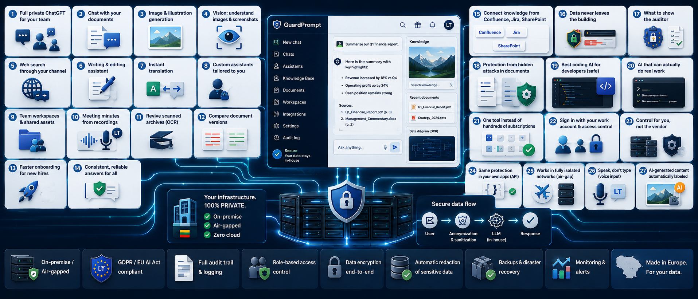

<p align="center">
  <a href="https://www.guardprompt.lt/" target="_blank">
    
  </a>
</p>
<br>
<p align="center">
  
</p>
<br>
<p align="center">🌐 <b>English</b> · <a href="README.lt.md">Lietuvių</a></p>

# GuardPrompt

## All the AI your company already uses — but inside your walls, and under your control.

GuardPrompt gives your people the same full ChatGPT-grade AI they already open on their phones — conversations with the most capable models, document analysis, image generation, web search, voice — but running on **your server, inside your walls.** Every word is anonymized before it leaves, so work never stops and data never leaks. The question isn't *whether* your company will use AI — it already does. The question is *whether you'll see it and control it.*

> **The uncomfortable truth.** While leadership debates whether it's "safe," your accountant is already pasting a payroll sheet into ChatGPT, your lawyer a contract, your developer your source code. Banning it doesn't work; people use it anyway, just in the shadows. The only real answer is to give them that power inside.

> 🚀 **Just want to install?** → [Quick Start](#quick-start)

### What changes from day one

| Today | With GuardPrompt |
|-------|------------------|
| Staff quietly paste data into ChatGPT | The same AI — but inside, under your control |
| "We can't use AI on real data" | You work with real contracts and case files |
| Minutes written by hand after every meeting | You record — and get a finished protocol |
| Hunting for an answer across dozens of files | You ask in plain language — answer with a source |
| Developers paste code into Copilot | They use the strongest AI, code stays hidden |
| The regulator asks — nothing to show | A log: who sent what, and when |
| Subscriptions × hundreds of people | One engine for the whole organization |

### What you actually get

**🤖 A full private ChatGPT for your whole team.**
One familiar window: chat with any model — global or local — everything ChatGPT does, only in your own house.

**📂 A conversation with your documents, not just the model.**
Upload a contract, a report or a whole knowledge base and ask in plain language — the answer comes with a link to its source. No need to know which of a thousand files holds it.

**🎨 Image and illustration generation.**
A poster, a diagram, an illustration for a deck or a draft — created in-house, with no external design tool and no data leaving.

**👁️ The ability to "see".**
Drop in a picture, a diagram or a screenshot — the AI reads and explains what's there. Even a scanned document or a chart.

**🌐 Web search — through your own channel.**
The AI checks the latest information online while your question is anonymized first. Fresh knowledge, without anyone tracking what you searched.

**✍️ Writing and editing help.**
A letter, a reply to a client, a report or a summary — a draft in seconds, in your tone and your language.

**🌍 Instant translation.**
Documents and messages translated between languages on the spot — nothing sent to Google Translate or any outside service.

**🗣️ Speak, don't type.**
Voice input across the whole system — dictate a question or text and the AI understands. The audio is processed on your machine.

**🧩 Custom assistants, tailored to you.**
Build specialized helpers — a legal, HR, IT or note-taking assistant — with your own rules and knowledge. AI that speaks your organization's language.

**👥 Shared team workspaces.**
Colleagues share chats, ready-made prompts and assistants — what works well isn't rebuilt from scratch at every desk.

**🎙️ A finished protocol instead of writing by hand.**
Start recording in the browser, and after the meeting a clean protocol is waiting for you. The audio is transcribed on your machine and never sent anywhere.

**📚 Scanned archives brought back to life.**
Thousands of scanned PDFs that were impossible to search become searchable and "talkative" like ordinary text.

**🔀 Document-version comparison.**
"How do these two versions of the contract differ?" — an answer with the concrete changes in seconds, not half a day of eye strain.

**🎓 Faster onboarding.**
A new hire asks the system, not a colleague — the AI explains documents, procedures and processes. Up to speed in days, not months.

**✅ Consistent, reliable answers for the whole organization.**
Everyone gets the same official answer from the same approved documents — not ten different opinions from ten colleagues.

**🔗 Knowledge from Confluence, Jira, SharePoint — automatically.**
Your existing systems sync into the knowledge base, so answers always draw on the latest information.

**😌 Peace of mind that data never leaves the building — even if someone is careless.**
Personal codes, account numbers, health or criminal-record data are masked automatically. And if the protection ever fails, the system would rather stop than let your data through.

**🛡️ Something to show the auditor.**
Every send is recorded: who, what and when. Meets GDPR and the new EU AI Act — proof, not a promise.

**🕵️ Protection from hidden attacks in documents.**
Even if an incoming document hides instructions meant to hijack the AI, they're neutralized — the AI obeys you, not an attacker.

**🏷️ AI-generated content labeled automatically.**
AI-generated images get a "created by AI" mark — meeting the new EU AI Act with no extra steps.

**🔒 Works in a fully isolated network.**
No internet, no cloud, no outside connection — GuardPrompt runs even air-gapped. For the most sensitive data, where "cloud" is banned outright.

**👨‍💻 The most powerful coding AI for developers — safely.**
Claude Code, VS Code and others work through GuardPrompt, so your source, client names and secrets stay invisible to the provider. The speed of Copilot, the risk of neither.

**🖥️ AI that can actually do real work, not just talk.**
A secure terminal lets the AI create files and brand-styled presentations on your behalf, sealed inside an isolated box with no right to leak anything. Power without danger.

**🔌 The same protection — inside your own apps.**
Not just the chat window: via an API you weave GuardPrompt's anonymization into your internal systems. Your app sends text — gets it back anonymized.

**💰 One tool instead of hundreds of subscriptions.**
Instead of paying for ChatGPT or Copilot per person, you have one engine for the whole organization. The more people use it, the more it pays off.

**🔐 Sign in with your work account, with access control.**
People sign in with the same company account — no new passwords — and each sees only what they're allowed to.

**🎛️ Control for you, not the vendor.**
Your server, your rules, your logo on the system, your chosen model — swap it whenever you like. Cut the internet entirely and everything keeps working.

> **10:14, Tuesday.** Rita in HR needs to compare two contract versions, write the meeting minutes, and find an old directive among thousands of scanned PDFs. Before — half a day. Today she opens GuardPrompt: uploads the contracts ("how do they differ?"), records the meeting (the protocol writes itself), asks the knowledge base ("where is that 2019 directive?") — answer with a link. Fifteen minutes. And **not one byte** left the server.

> **GuardPrompt isn't "another tool." It's permission for your entire organization to use AI the way you've long wanted to — but never dared.**

---

## Who is it for?

### 🏛️ Government & public sector
Registries, ministries, agencies handling citizen and confidential data — often on restricted or isolated networks where "the cloud" simply isn't an option.

### 🏦 Regulated business
Finance, banking, insurance, legal and healthcare institutions — where every movement of data must be explainable to an auditor.

### 🔐 Any organization with sensitive data
That wants AI's power but cannot let data leave the building, and needs fast, trustworthy access to its own knowledge.

---

## How it works

Three steps, no jargon:

1. **Everything stays inside.** The whole system — chats, documents, search, the model — runs on your server. Nothing leaves on its own.
2. **Everything is anonymized before it leaves.** If you do route something to an external model, GuardPrompt first masks the sensitive data (names, IDs, health…). And if that protection fails, the request is stopped, not passed through.
3. **You see and control it.** Every send is logged, and the user sees exactly what was masked in their message.

> 📐 Technical diagram (all containers, ports, data flows): [ARCHITECTURE.md](ARCHITECTURE.md)

---

## Capabilities — for IT & security

### 🔒 100% On-Premise
Runs entirely on your hardware. No mandatory internet connection; no data leaves
your environment unless you route a request through a provider you chose.

### 🛡️ Multi-Layer Anonymization
Every document and message is scrubbed before processing:
- **Deterministic regex layer** — emails, phones, IBANs, Lithuanian personal
  codes, credit cards, crypto addresses, VAT/company codes, passports, SODRA,
  vehicle & IT identifiers (VIN, MAC, IMEI, plates), secrets/tokens/keys, GPS.
- **On-prem NER (gliner)** for GDPR Art. 9/10 **special categories** — health,
  criminal, political, religious, union, biometric, ethnicity, sex life, beliefs
  — plus a name supplement for foreign/inflected names. **GPU-accelerated with
  dynamic batching (~70 req/s).**
- **Prompt-injection defense** — a 4-layer detector (regex + de-obfuscation,
  hidden-text, script-anomaly, contrastive semantic) neutralizes hostile
  instructions to `[PROTECTION]` instead of rejecting the document.
- **Case-robust & fail-closed** — names are caught even in lowercase self-intros
  ("mano vardas donatas"), and if the NER service is unreachable the request is
  **blocked, not sent unmasked** — special-category PII never egresses on a failure.
  Both chat messages **and** tool/terminal output are scrubbed before any model call.

### 🤖 Safe Frontier Coding AI (Claude proxy)
Let developers use Claude Code, the VS Code extension or JetBrains — and the
desktop app in API-key mode — while a reversible-pseudonymization gateway ensures
no customer name, credential or line of sensitive source ever reaches Anthropic in
the clear — with a **who-sent-what
audit trail** (GDPR Art. 30). See [GP-CLAUDE-PROXY.md](GP-CLAUDE-PROXY.md).

### 📄 Advanced Document Processing
PDF → text/markdown, OCR for scans, HTML cleaning, image description (GPU
edition), multi-page support — all via the Docling engine.

### 💬 RAG-Powered AI Chat
OpenWebUI + Qdrant for context-aware, cited answers over your own knowledge base,
with a **multilingual embedding stack (bge-m3 + bge-reranker-v2-m3)** tuned so
non-English (e.g. Lithuanian) retrieval actually works.

### 🎙️ On-Premise Meeting Transcription & Protocols
Record a meeting (microphone **and** system audio) straight from the browser and get
an accurate **Lithuanian** transcript from a local speech-to-text engine (a LIEPA-3
fine-tuned Whisper model) — the audio never leaves your machine, so no recording is
ever sent to a cloud transcription service. The transcript is anonymized like any
other text and turned into a clean, structured **meeting protocol** by your chosen
model, saved as an OpenWebUI note with the recording attached. Built-in voice input
across the whole app uses the same local engine (auto-detects English too). **Result:
minutes produced in minutes, with zero audio egress.**

### 🖥️ Sandboxed Command Terminal
An optional real terminal inside OpenWebUI, running in an isolated sandbox with a
**default-deny egress firewall** and per-user home isolation; package installs and
`sudo` are gated to administrators only. Command output is anonymized before it can
reach any model — so even interactive tooling stays leak-proof.

### 📊 Built-in Observability
A full **Zabbix** monitoring stack ships with the platform: uniform
Prometheus-style `/metrics` from every service, standard exporters (host,
containers, Postgres, GPU, blackbox), dashboards, and **preventive triggers**
(disk/cert/pool exhaustion forecasting) plus **memory-leak and code-quality
triggers**. See [MONITORING.md](MONITORING.md).

### 🧩 Modular Architecture
Independent, independently-scalable services: OpenWebUI · Docling · Anonymizer ·
gliner NER · GuardProxy · Claude proxy · Qdrant · PostgreSQL · Zabbix ·
LLM backend (OpenAI-compatible / routed) · local vision (Ollama on Ubuntu, LM
Studio on Windows).

### ⚙️ CPU & GPU Editions
Choose based on your infrastructure; the same platform, scaled to your hardware.

---

## 101 reasons to choose GuardPrompt

Want the exhaustive, point-by-point case for the buying decision or the IT
department? The full capability list (privacy, anonymization, compliance,
integrations, deployment, monitoring…) ➡️ **[101-REASONS.md](101-REASONS.md)**

A shorter "what problems it solves" breakdown ➡️ [WHAT_PROBLEMS_SOLVES.md](WHAT_PROBLEMS_SOLVES.md)

---

## Compliance — GDPR & EU AI Act

GuardPrompt is built to help organizations meet **GDPR** (2016/679) and the **EU
AI Act** (2024/1689) through technical measures: on-prem isolation, anonymization
of GDPR Art. 9/10 special categories, removal of the sensitive attributes the AI
Act Art. 5(1)(g) bars from being inferred, and a pseudonymized audit record of AI
usage — **compliance by design.**

Full article-by-article mapping ➡️ [COMPLIANCE.md](COMPLIANCE.md) · Risk assessment ➡️ [RISK-ASSESSMENT.md](RISK-ASSESSMENT.md)

---

## Quick Start

**Requirements:** Docker Engine + Docker Compose v2. For GPU acceleration: NVIDIA
drivers + the NVIDIA Container Toolkit (Linux), or Docker Desktop with WSL2 GPU
support (Windows). GuardPrompt also runs CPU-only, just slower.

### Linux

```bash
git clone https://github.com/guardprompt/GuardPrompt.git /opt/guardprompt
cd /opt/guardprompt
chmod +x install.sh
./install.sh
```

### Windows (PowerShell)

```powershell
git clone https://github.com/guardprompt/GuardPrompt.git C:\GuardPrompt
cd C:\GuardPrompt
.\install.ps1
```

The installer does the rest: it generates `.env` with fresh strong passwords for
every service (database, Qdrant, Grafana, the Zabbix stack), **prompts for your
brand name and logo** (so the UI is branded on first boot), creates the
per-machine licence key, builds and starts every container, and installs the
GuardPrompt OpenWebUI function. Partway through it asks you to create the admin
account at `http://localhost:8080` (the first signup becomes admin).

**Then:** add your external API keys — [CREDENTIALS.md](CREDENTIALS.md) — and
activate the licence — [LICENSING_INFO.md](LICENSING_INFO.md).
Full step-by-step guide: [INSTALLATION.md](INSTALLATION.md).

### Updating

Releases are **force-pushed**, so `git pull` will fail on a diverged history.
Reset to the published state instead:

```bash
git fetch origin && git reset --hard origin/main
docker compose up -d --build      # --build, or stale images keep running
```

> `.env`, `machine_key.txt` and your branding files are gitignored, so a reset
> leaves your passwords, licence and logo untouched.

---

## Documentation

- 🚀 **Install:** [INSTALLATION.md](INSTALLATION.md) — the full step-by-step guide.
- 📐 **Architecture:** [ARCHITECTURE.md](ARCHITECTURE.md) — all containers, ports and dependencies (Mermaid diagram).
- 🔑 **Credentials:** [CREDENTIALS.md](CREDENTIALS.md) — how to obtain every key/ID for `.env`.
- 🔌 **Anonymization API:** [API.md](API.md) — anonymize text and documents from your own applications (REST, API key).
- 🤖 **Claude proxy:** [GP-CLAUDE-PROXY.md](GP-CLAUDE-PROXY.md) — route Claude Code, VS Code and IntelliJ through GuardPrompt.
- 🧠 **OpenAI proxy (OpenRouter):** [GP-OPENAI-PROXY.md](GP-OPENAI-PROXY.md) — OpenAI-compatible reversible-anonymizing gateway for SQL Developer / OpenAI tools.
- 🖥️ **AI terminal & decks:** [OPEN-TERMINAL.md](OPEN-TERMINAL.md) — the sandboxed terminal for real files and presentations.
- 📊 **Monitoring:** [MONITORING.md](MONITORING.md) — full Zabbix observability with preventive and leak triggers.
- ⚖️ **Compliance:** [COMPLIANCE.md](COMPLIANCE.md) · **Risk:** [RISK-ASSESSMENT.md](RISK-ASSESSMENT.md).
- 💡 **101 reasons:** [101-REASONS.md](101-REASONS.md) · **What it solves:** [WHAT_PROBLEMS_SOLVES.md](WHAT_PROBLEMS_SOLVES.md).

---

## Licensing

See the full info here ➡️ [LICENSING_INFO.md](LICENSING_INFO.md)
